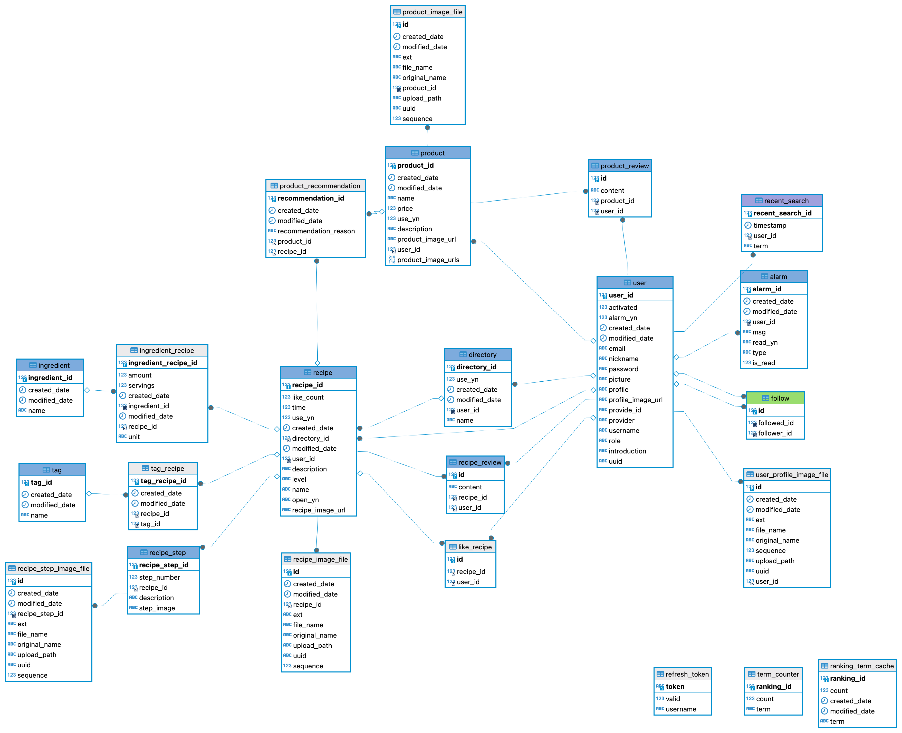
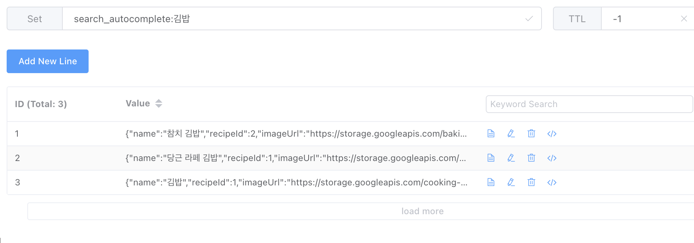
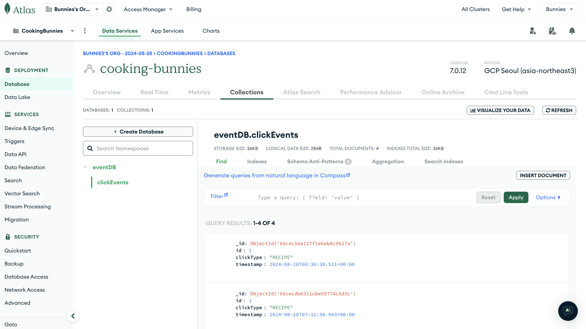
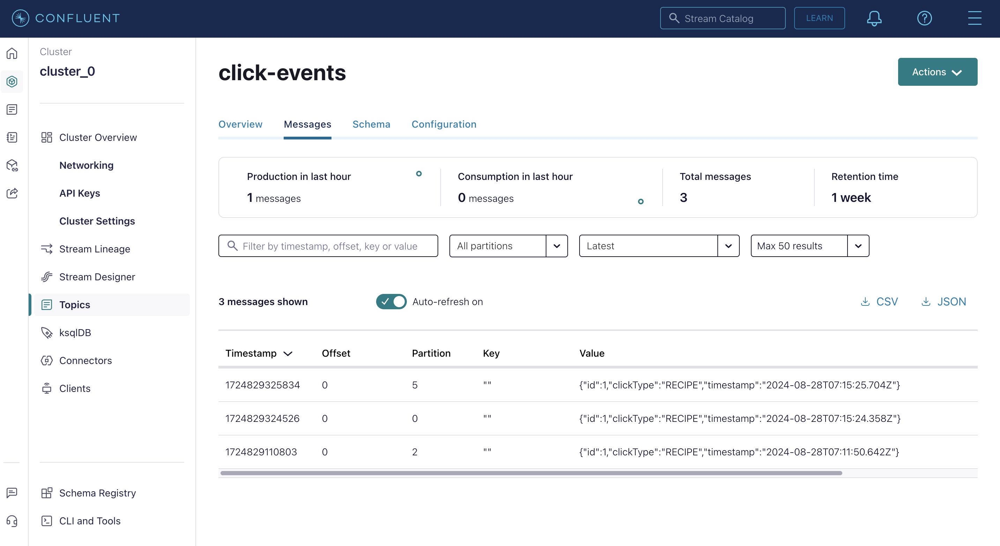

# Recipe Diary
### 레시피를 공유하는 웹 사이트

## 주요 기능

사용자는 에디터를 팔로우하여 피드를 통해 레시피를 조회할 수 있다.
사용자가 관심 키워드(지중해식, 다이어트 등)를 등록하면 관련 레시피를 추천한다.
또한 검색 키워드, 클릭 상품 와 같은 행동에 따라 상품이나 레시피를 추천한다.

## Role

관리자(ADMIN), 에디터(EDITOR), 판매자(SELLER), 사용자(USER) 각 역할에 따라 권한이 주어진다.

- 관리자는 권한을 부여하고 게시물 삭제 등 권한을 가진다.

- 에디터는 레시피를 등록, 팔로우 권한을 가진다.

- 판매자는 상품을 등록하는 권한을 가진다.

- 사용자는 레시피를 조회, 에디터 팔로우, 상품 조회 등 권한을 가진다. 

## ERD


## DOMAIN
### Recipe
디렉토리를 만들어 레시피를 저장할 수 있다. 재료, 조리 순서, 태그, 요리 설명, 이미지 등이 포함된다.

### Ingredient
재료 이름을 가지고있다. 재료 이름으로 검색하여 레시피를 검색할 수 있다. 

### IngredientRecipe
각 레시피마다 재료의 단위나 양이 달라질 수 있어서 
Ingredient와 Recipe를 매개하는 역할로 IngredientRecipe를 두어 활용한다.
각 레시피의 인분 기준(servings), 재료의 단위(Unit), 양(amount)을 가지고 있다. 
```java
public class IngredientRecipe extends BaseTime {
    @Id
    @GeneratedValue(strategy = GenerationType.IDENTITY)
    @Column(name = "INGREDIENT_RECIPE_ID")
    private Long id;
    
    @Column(nullable = false)
    private BigDecimal amount; // 재료 양
    
    @Enumerated(EnumType.STRING)
    @Column(length = 20)
    private Unit unit; // 재료 단위
    
    @Column(nullable = false)
    private Integer servings; // 몇인분 기준
  
    @ManyToOne(fetch = FetchType.LAZY)
    @JoinColumn(name = "RECIPE_ID")
    private Recipe recipe; // 레시피

    @ManyToOne(fetch = FetchType.LAZY)
    @JoinColumn(name = "INGREDIENT_ID")
    private Ingredient ingredient; // 재료
}
```
```java
    // 레시피에 해당하는 재료의 이름과 기준 인분에 따른 양을 가져오는 querydsl 작성 부분
    public List<IngredientResponseDto> findIngredientsByRecipeId(Long recipeId) {
        return queryFactory
                .select(Projections.fields(IngredientResponseDto.class,
                        ingredientRecipe.recipe.id.as("recipeId"),
                        ingredient.name.as("name"),
                        ingredientRecipe.unit.as("unit"), // Unit의 displayName으로 설정
                        ingredientRecipe.amount.as("amount"),
                        ingredientRecipe.servings.as("servings")))
                .from(ingredientRecipe)
                .join(ingredientRecipe.ingredient, ingredient)
                .where(ingredientRecipe.recipe.id.eq(recipeId))
                .fetch();
    }
```
### Tag
각 레시피마다 태그를 추가할 수 있다. 태그 이름으로 검색 가능하다.

### RecipeStep
해당 레시피 중 몇 번째 Step인지를 나타내는 단계 번호(stepNumber), 단계 설명, 단계 이미지를 포함한다. 
단계마다 최대 하나의 이미지를 등록할 수 있다.
```java

```
### AutoCompleteSearch
Redis를 활용하여 검색 자동완성 기능을 구현했다. 검색어를 key로 하고 (상품 id, 이미지 url)을  value로 같이 캐싱하여 
검색어 자동완성 시 이미지도 미리보기 가능하도록 했다.
```java
    // prefix에 맞는 레시피를 가져온다. RedisAutoCompletePreviewDto에는 레시피 이름, 레시피 id, 이미지 url을 담아 보낸다.
    @Transactional(readOnly = true)
    public List<RedisAutoCompletePreviewDto> autocomplete(String prefix) {
        String redisPattern = "search_autocomplete:" + prefix + "*";
        Set<String> keys = redisTemplate.keys(redisPattern);
        List<RedisAutoCompletePreviewDto> autocompleteResults = new ArrayList<>();
        ObjectMapper mapper = new ObjectMapper();
        if (keys != null && !keys.isEmpty() && keys.size() > 0) {
            for (String key : keys) {
                Set<Object> values = redisTemplate.opsForSet().members(key);
                if (values != null) {
                    for (Object value : values) {
                        RedisAutoCompletePreviewDto dto = mapper.convertValue(value, RedisAutoCompletePreviewDto.class);
                        autocompleteResults.add(dto);
                    }
                }
            }
        }
        return autocompleteResults;
    }
```


### SearchRecord
사용자의 최근 검색어를 저장하기 위해 만들었다. 이미 저장된 검색어는 timestamp만 갱신하고 중복되지 않도록 처리한다.
```java
    public void addSearchRecord(Long userId, String term) {

      // 사용자 조회
      User user = userRepository.findById(userId)
              .orElseThrow(() -> new CustomException(USER_NOT_FOUND));
      SearchRecord existingSearch = searchRecordQueryDslRepository.selectSearchRecordsByUserIdAndTerm(userId, term);
    
    
      if (existingSearch != null) {
        // 검색어가 이미 존재하면 timestamp만 업데이트
        existingSearch.setTimestamp(LocalDateTime.now());
        searchRecordRepository.save(existingSearch);
      } else {
        // 현재 시간 기준으로 새로운 검색어 생성
        SearchRecord searchRecord = SearchRecord.create(term, user);
        SearchRecord save = searchRecordRepository.save(searchRecord);
        // 새로운 검색어 추가
        user.addSearchRecord(save);
        userRepository.save(user);
      }
}
```
### ClickRecord
사용자의 레시피, 상품 등 클릭 이력을 저장한다.



### Popular (RankingTermCache, TermCounter)
인기 검색어를 일정 시간마다 배치를 활용해 캐싱한다.
TermCounter에 각 검색어마나 검색 횟수를 저장한다. 
Spring Batch로 Schedule하여 카운트가 높은 순서대로 RankingTermCacheRepository에 저장하여 활용한다. 
```java
    // search api가 요청되면 해당 검색어 카운트 증가
    public void incrementSearchCount(String searchTerm) {
        Optional<TermCounter> termCounterOptional = termCounterRepository.findByTerm(searchTerm);
        if (termCounterOptional.isPresent()) {
            TermCounter termCounter = termCounterOptional.get();
            termCounter = termCounter.updateCount();
            termCounterRepository.save(termCounter);
        } else {
            termCounterRepository.save(TermCounter.builder()
                    .term(searchTerm)
                    .count(1)
                    .build());
        }
    }
```
```java
    /**
     * 매 시간 실행되는 배치
     * 검색어 카운트를 내림차순 정렬하여 상위 10개를 캐시 테이블에 저장
     */
    @Scheduled(cron = "0 0 * * * *") // 매 시간마다 실행
    public void updateRankingTermCache() {
        List<TermCounter> topTerms = termCounterQueryDslRepository.selectTop10RankingTerms();
        List<RankingTermCache> cacheTerms = topTerms.stream()
                .map(term -> RankingTermCache.builder()
                        .term(term.getTerm())
                        .count(term.getCount())
                        .build())
                .collect(Collectors.toList());
        rankingTermCacheRepository.deleteAll();
        rankingTermCacheRepository.saveAll(cacheTerms);
    }
```
### Follow
다른 사용자를 팔로우, 언팔로우 할 수 있다. 내 프로필에서 팔로잉 하는 유저, 팔로워를 조회할 수 있다. 
팔로잉 하는 유저들의 레시피를 볼 수 있는 피드에 활용된다.
```java
public class Follow {
    @Id
    @GeneratedValue(strategy = GenerationType.IDENTITY)
    private Long id;

    @ManyToOne
    @JoinColumn(name = "follower_id")
    private User follower; // 유저(팔로우하는 사용자)

    @ManyToOne
    @JoinColumn(name = "followed_id")
    private User followed; // 에디터(팔로우되는 사용자)
}
```
```java
    // 팔루우 로직
    @Transactional
    public void follow(Long followerId, UUID followedId) {
        User follower = userRepository.findById(followerId)
                .orElseThrow(() -> new CustomException(USER_NOT_FOUND));

        User followed = userRepository.findByUuid(followedId)
                .orElseThrow(() -> new CustomException(USER_NOT_FOUND));
        if (follower.equals(followed)) {
            throw new CustomException(CANNOT_FOLLOW_SELF);
        }
        followRepository.save(Follow.builder().followed(followed).follower(follower).build());
        alarmService.createAlarm(followed.getId(), follower.getUsername() + "님이 당신을 팔로우 했습니다.");
        alarmService.createAlarm(follower.getId(),   followed.getUsername()+"님 팔로우를 시작했습니다!");
    }
    // 언팔로우 로직
    @Transactional
    public void unFollow(Long followerId, UUID followedId) {
        User follower = userRepository.findById(followerId)
                .orElseThrow(() -> new CustomException(USER_NOT_FOUND));

        User followed = userRepository.findByUuid(followedId)
                .orElseThrow(() -> new CustomException(USER_NOT_FOUND));
        long removedRowCount = followQueryDslRepository.unFollow(follower, followed);
    }
```
### LIKE
사용자가 어떤 레시피를 '좋아요' 하기 위한 도메인이다. Like마다 하나의 User, 하나의 Recipe를 가지고있다. 
```java
// 누가 어떤 레시피를 좋아요 했는지 관리하기 위해 두 도메인 포함
public class Like {
    @Id
    @GeneratedValue(strategy = GenerationType.IDENTITY)
    private Long id;

    @ManyToOne
    @JoinColumn(name = "recipe_id")
    private Recipe recipe;

    @ManyToOne
    @JoinColumn(name = "user_id")
    private User user;

}
```

### PRODUCT
판매자(Seller) 역할은 상품을 등록할 수 있다. 레시피에 연관 상품을 보여주기 위해 만들었다.
```java
    // Naver Shopping API를 활용해 상품 가져오기
    public ShoppingService(WebClient.Builder webClientBuilder) {
        this.webClient = webClientBuilder
                .baseUrl(NAVER_API_DOMAIN)
                .defaultHeader("X-Naver-Client-Id", clientId)
                .defaultHeader("X-Naver-Client-Secret", clientSecret)
                .build();
    }

    public Mono<ProductResponse> searchProducts(String query, Integer display, Integer start, String sort) {
        return this.webClient.get()
                .uri(uriBuilder -> uriBuilder
                        .queryParam("query", query)
                        .queryParam("display", display != null ? display : 10)
                        .queryParam("start", start != null ? start : 1)
                        .queryParam("sort", sort != null ? sort : "sim")
                        .build())
                .retrieve()
                .bodyToMono(ProductResponse.class);
    }
```
### ALARM
팔로잉 하는 사용자가 레시피를 올렸을 때, 누군가를 팔로우 하면 두 사용자에게 알림이 발송된다. 이 때 Web socket을 활용했다.
read 컬럼으로 읽음 처리가 가능하다.

### RECOMMEND
각 레시피마다 추천 상품을 등록해둔다.

### JWT
Spring Security와 함께 활용한다. 쿠키에 토큰을 저장한다.

### REVIEW
레시피, 상품 각각 리뷰를 작성할 수 있다. 리뷰의 형태가 서로 달라질 수 있어 도메인을 따로 만들었다. 


## 부수 기능

- validation (중복 체크, 프론트 메세지 전달)
- actuator, prometheus

# Library

- Spring Boot: 3.2.5
    - Spring Boot Starter Data JPA: 3.2.5
    - Spring Boot Starter Web: 3.2.5
    - Spring Boot Starter Validation: 3.2.5
    - Spring Boot Starter Actuator: 3.2.5
    - Spring Boot Starter AOP: 3.2.5
- Springdoc OpenAPI: 2.0.2
- Spring Cloud GCP Starter: 1.2.5.RELEASE
- Spring Cloud GCP Storage: 1.2.5.RELEASE
- Spring Cloud GCP Starter SQL MySQL: 1.2.5.RELEASE
- Spring Cloud GCP Starter Redis: 1.2.5.RELEASE
- Querydsl JPA: 5.0.0
- Querydsl APT: 5.0.0
- Lombok: latest
- P6Spy Spring Boot Starter: 1.5.8
- Micrometer Registry Prometheus: latest
- Redis Clients (Jedis): 7.2.5 (latest)

# DB
- Docker MariaDB 11.4.2
- (Google Cloud SQL MySQL 8.0.31) 
- Google Cloud Storage Bucket (이미지 저장)

# CI/CD

- Github
- Docker
- Cloud Build
- Cloud Run
- Cloud Deploy

# Tools

- Intellij
- MacOS

# API Docs
- Local Swagger: http://localhost:8080/swagger-ui/index.html#/
- Local Actuator: http://localhost:8080/manage


